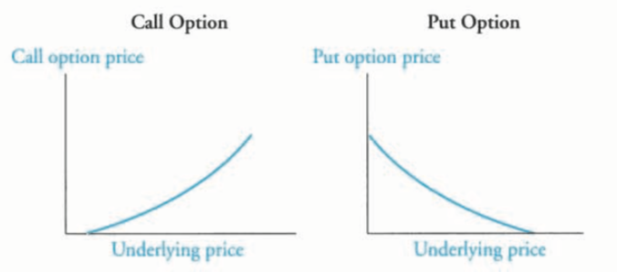
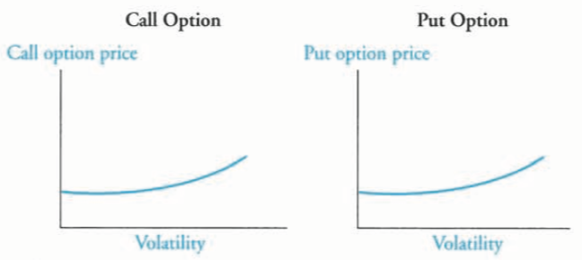
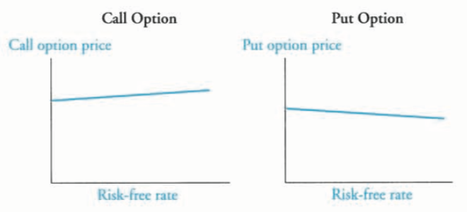
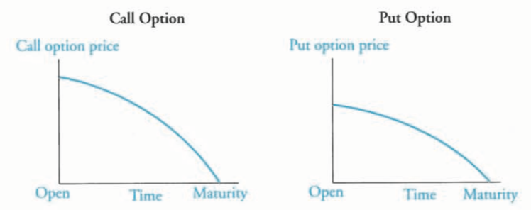

### Relationships between spot and forward rates
For an upward-sloping spot curve, the forward curve will be above the spot curve. Conversely, when the spot curve is downward sloping, the forward curve will be below it.

+ Swap spread

  spread indicating 大型金融机构与政府之间的信用风险

  $swap\ spread_t = swap\ rate_t - Treasury\ yield_t$
+ I-spread

  spread for a credit-risky bond by which the yield exceeds the swap rate. In a case where swap rate for a specific maturity is not available, the missing swap rate can be estimated from the swap rate curve using linear interpolation (hence the "I" in I-spread).公司和大型金融机构之间的信用/流动性风险

  $I-spread = bond\ rate - swap\ rate$
+ Z-spread

  spread between corporate bond and T-bond

  公司和政府之间的信用/流动性风险
+ TED spread

  spread between T-bill(美国短期国债) and Eurodollar futures contract. The TED spread is seen as an indication of the risk of interbank loans.银行(counterparty)和政府之间的违约风险

  $TED = LIBOR - Tbill$
+ LIBOR-OIS spread

  OIS stands for overnight indexed swap. The LIBOR-OIS spread is the amount by which the LIBOR rate (which includes credit risk) exceeds the OIS rate (which includes only minimal credit risk). This makes it a useful measure of credit risk and an indication of the overall wellbeing of the banking system. A low LIBOR-OIS spread is a sign of high market liquidity while a high LIBOR-OIS spread is a sign that banks are unwilling to lend due to concerns about creditworthiness.短期货币市场流动性风险

  $LIBOR-OIS = LIBOR - OIS$

### Theories of term structure of interest

+ Unbiased ( or pure) expectations theory

  Every mmaturity strategy has the same expected return over a given investment horizon. Long-term interest rates equal the mean of future expected shor-term horizon. Investors don't demand a risk premium for maturity strategies that differ from their investment horizon.长期利率是短期利率的平均；Forward rate是短期利率的无偏估计量；风险中性。
+ Local expectations theory

  It preserves the risk-neutrality assumption only for short holding periods. In other words, over longer periods, risk premiums should exist. Over short time periods, every bond should earn the risk-free rate.
  短期风险中性；长期考虑风险。
+ Liquity preference theory

  Plus a liquity premium to compensate investors for exposure to interest rate risk.
  Forward rate是spot rate的有偏估计量，考虑了流动性补偿。
+ Segmented markets theory（市场分割理论）

  Yield are not determined by liquidity premiums and expected spot rates. Rather, the shape of the yield curve is determined by the preferences of borrowers and lenders. 长短期利率市场相互独立，受市场内供需影响。
+ Preferred Habitat theory（习惯性偏好理论）

  对某个特殊期限有很大的偏好。改变其偏好需要足够的补偿（对习惯偏好的补偿）。

### Modern term structure models

dr = 波动项 + 扰动项

即
$\Delta r = m \Delta t + n \Delta Z$

+ Equilibrium term structure models

  资金市场需求和供给均衡。They are one factor or multifactor models. CIR和V都是one factor模型，fator为short term interest rate, r.
  + The Cox-Ingersoll-Ross Model

    assumption based on macro economy; deterministic part (drift term) + stochastic part; mean reversion; volatility to increase the level of interest rates.
    $$dr = a(b - r) dt + \sigma \sqrt{r} dz$$
    b = long-run value of short-term interest value
  + The Vasicek Model

    mean reversion; volatility remains constant over the period of analysis; not increase with the level of interest rate; theoretically possible for the interest rate to be negative.
    $$dr = a(b - r) dt + \sigma dz$$

+ Arbitrage-Free Models

  市场价格和理论价格相等时的利率水平
  + The Ho-Lee Model

    $$dr_t = \theta_t dt + \sigma dz_t$$
    where $\theta_t$ is the time-dependent drift term from market prices

### Arbitrage-free valuation framework

$$P_{i,H} = P_{i, L} \times e^{2 \sigma}$$

A `Monte Carlo forward-rate simulation` involves randomly generating a large number of interest rate paths, using a model that incorporates a volatility assumption and an assumed probability distribution. A key feature of the Monte Carlo method is that the underlying cash flows can be *path dependent*.

## Valuation and analysis: bonds with embedded options

### fixed-income securities with embedded options

+ callable bonds
  + European-style option, can only be exercied on a single day immediately after lockout period
  + American-style, any time after lockout period
  + Bermudan-style, at fixed dates after lockout period
+ Putable bonds
  + extendible bond, which allows investor to extend the maturity of the bond

$$V_{call} = V_{straight} - V_{callable}$$

$$V_{putable} = V_{straight} + V_{put}$$

### compare effective duration of callable, putable, and straight bonds

+ Effectvie duration of floater $\approx$ time (years) to next reset, for example, the effective duration of a bond with one-year Libor annually, is close to the time to next reset

### compare effective convexities of callable, putable, and straight bonds

+ Straight bonds have positive effective convexity: increse in value is higher when rates fall than the decrease in value when rates increase by an equal amount
+ When rates are high, callable bonds exhibit positive convexity; when the call option is near the money, its convexity turns negative;
+ Putable bonds exhibit positive convexity throghout

### convertible bond

The owner of a `convertible bond` has the right to convert the bond into a fixed number of common shares of the issuer during a specified timeframe (`conversion period`) and at a fixed amount of money (`conversion price`)

`conversion ratio` is the number of common shares for which a convertible bond can be exchanged.

`conversion price` = the issue price / conversion ratio.

`conversion value` = market price of stock * conversion ratio.

`straight value` of a convertibale bond is the value of the bond if it were not converitble.

`minimum value of a convertibale bond` is the greater of its conversion value or its straight value.

`market conversion price` = market price of convertible bond / conversion ratio

`market conversion premium per share` = market conversion price - stock's market price

`market conversion premium ratio` = market conversion premium per share / market price of common stock

### Effect of interest rate volatility on the value of callable and putable bonds

+ interest rate volatility
  + volatility rises, option value rises
+ level and shape of the yield curve
  + level
    + callabel: yield rises, bond value falls, call option falls
    + putable: yield rises, bond value falls, put option rises
  + shape
    + callable: upward smaller, downward larger
    + putable: upward larger, dowward smaller

`Key Rate Durations`: Sensitivity of a bond’s price to *changes* in *specific maturities* on the benchmark yield curve. Also called partial durations.

### One-sided durations

+ The fact that the one-sided up-duration is higher than the one-sided down-duration confirms that the callable bond is more sensitive to interest rate rises than to interest rate declines.
+ putable bond is more sensitive to interest rate declines than to interest rate rises.

## Credit analysis models

`Recovery rate`: Loss given defualt (%) = 100 - recovery rate

`present value of expected loss` = (value of risk-free bond) - (value of credit-risky bond) = expected loss + rsik premium - time value discount

### Strength and weaknesses of credit ratings

+ Strength
  + simple to understand
  + stable over time, reducing volatility in the debt markets.
+ Weaknesses
  + stability in credit ratings comes at the expense of reduction in correltation with default probability
  + not adjust with the business cycle
  + conflicts of interest may make the ratings less reliable.

### credit models

#### structural models

those models of corporate credit risk are based on the structure of a company's balance sheet and rely on insights provided by option pricing theory.

owing the company's equity is equivalent to holding a European call option on the company's assets.

because historical asset returns are not available, implicit estimation techniques are needed for input parameters of the structural models.
**value of risky debt = value of risk-free debt - value of put option on company's assets**

assumptions of the structural nmodel:

1. assests are traded in arbitrage-free market with a time T value that has a lognormal ditribution with mean $\mu$ and variance $\sigma^2T$. The assets have a rate of return of $\mu\%$ per year. The asset return volatility ($\sigma^2$) is also assumed to be constant. The company has a simple balance sheet structure.

#### reduced form models

do not impose assumption on the balance sheet, instead they impose assumptions on the output of a structural model. Reduced form models also allow the analyst flexibility to incorporate real world conditions in the model.

The input estimates for reduced form models can be estimated using historical data, which are called hazard rate estimation.

assumptions of the reduced form nmodel:

1. zero-coupon bond liability that trades in frictionless and arbitrage-free markets
2. the risk-free interest rate and the state of the economy are stochastic.
3. the recovery rate is also stochastic and depends on the state of the economy

## Credit default swaps

credit event: bankcrupty, failure to pay, and restructuring.

upfront premium (or upfront payment) = (credit spread - fixed coupon) * duration

### types of CDS

+ single-name CDS: pays off not only when the reference entity defaults on the reference obligation but also when the reference entity defaults on any other sue that is ranked pari passu (i.e., same rank) or higher.
+ Index CDS: an exposure to the credit risk of several companies simlutaneously

### principle

short (buy protection) high spread, long (sell protection) low spread

## Pricing and valuation of forward commitments

+ Equity forward contracts with discrete dividends

  $$V_t(long\ position) = [S_t - PVD_t] - [\frac{FP}{(1+R_f)^{(T-t)}}]$$

+ Equity forward contracts with continuous dividends

  $$FP(on\ an\ equity\ index) = S_0 \times e^{(R_c^c-\delta^c)\times T}$$

  where:

  $R_f^c$ = continuously compounded risk-free rate

  $\delta^c$ = continuously compounded dividend yield

+ value of the forward contract on an equity index
  $$V_t(of\ the\ long\ position) = (\frac{S_t}{e^{\delta^c \times (T-t)}} - \frac{FP}{e^{R_f^c \times (T-t)}})$$

+ Forwards and future on fixed income securities

  the quoted futures price (QFP) is adjusted using the conversion factor (CF) for the cheapest-to-deliver bond:

  $$QFP = FP / CF = [(full\ price)(1+R_f)^T - AI_T - FVC](\frac{1}{CF})$$

  where

  the full price = clean price + accrued interest at t=0

  $AI_T$ = accrued interest at futures contract maturity

+ the fixed periodic-rate on an n-period swap at initiation can be calculated as:

  $$C = \frac{1 - Z_4}{Z_1 + Z_2 + Z_3 + Z_4}$$

  where:

  $Z_n = \frac{1}{1 + R_n}$ = price of n-preiod zero-coupon bond for $ of principal

## Valuation of contingent claims

the probabilities of an up-move and a down-move are calculated based on the size of the moves, as well as the risk-free rate, as:

$$\pi_U = \frac{1 + R_f - D}{U - D}$$

since $1+R_f = D*P_D + U*P_U = D*(1-P_U) + U*P_U = (U-D)*P_U + D$

+ Put-Call parity
  $$S_0 + P_0 = C_0 + PV(X)$$

+ hedge ratio (or delta): the fractional share of stock needed in the arbitrage trade
  $$h = \frac{C^+ - C^-}{S^+ - S^-}$$

### the Black-Scholes-Merton mode

#### the assumption underlying the Black-Scholes-Merton mode

1. The underlying asset price follow a geometric Brownian motion process. The return on the underlying asset follows a lognormal distribution. In other words, the logarithmic continuously compouded return is normally distributed.
2. The (continuous compounded) risk-free is constant and known. Borrowing and lending are both at the risk-free rate.
3. The volatility of the returns on the underlying asset is ocnstant and known. The price of the underlying changes smoothly (i.e., does not jump abruptly).
4. Markets are "frictionless." There are no taxes, no transactions costs, and no restrictions on short sales or the use of short-sale proceeds. Continuous trading is possible, and there are no arbitrage opportunitis in the marketplace.
5. The (continuously compounded) yield on the underlying asset is constant.
6. The options are European options (i.e., they can only be exercised at expiration).

#### option using BSM model

+ Call option
  $$C_0 = S_0 N(d_1) - e^{-rT} X N(d_2)$$

+ Put option
  $$P_0 = -S_0 N(-d_1) + e^{-rT} X N(-d_2)$$

+ options on currencies
  $$C_0 = S_0 e^{-r(B)T} N(d_1) - e^{-r(P)T} X N(d_2)$$
  $$P_0 = -S_0 e^{-r(B)T} N(-d_1) + e^{-r(P)T} X N(-d_2)$$

  where:

  r(P) = continuously compounded price currency interest rate

  r(B) = continuously compounded base currency interest rate

  BASE/PRICE, e.g., 1.25 EURO/USD = 1 euro is equal to 1.25 dollar

### The Black Model

$$C_0 = e^{-R_f^c \times T}[F_T  N(d_1) - X N(d_2)] $$

where:

$\sigma$ = standard deviation of returns on the futures contract

$F_T$ = futures price

#### interpret each of the option Greeks

There are five inputs to the BSM model: asset price, exercise price, asset price volatility, time to expiration, and the risk-free rate. The relationship between each input (except the exercise price) and the option price is captured by sensitivity factors known as "the Greeks".

+ **Delta ($\delta$)** describe the relationship between changes in asset prices and changes in option prices. Call option are positive while put option are negative.

  delta = the slope of the prior-to-expiration curve = d(option) / d(stock)

  

+ **Gamma ($\gamma$)** measures the rate of change in delta as the underlying stock price changes. Gamma captures the curvature of the option value versus stock price relationship.

  gamma = d(delta) / d(stock)

+ **Vega ($\nu$)** measures the sensitivity of the option price to changes in the volatility of returns on the underlying asset.

  vega = d(option) / d(volatility of returns)

  

+ **Rho ($\rho$)** measure the sensitivity of the option price to changes in the risk-free rate.

  rho = d(option) / d(risk-free rate)

  

+ **Theta ($\theta$)** measures the sensitivity of the option price to the passgae of time. theta is less than zero as time passes and option approaches the maturity date, its value decreases.

  

## Derivative strategies

+ interest rate swap

  value of a payer swap = value of a floating rate note - value of a fixed rate bond

+ stock index futures

  number of contracts short = (portfolio value to be hedge) / (index value * multiplier)

+ synthetic puts and calls

  $$S_0 + P_0 = C_0 + PV(X)$$

+ synthetic assets with forwards/ futures

  long futures + risk-free asset = long stock

+ covered call

  covered call = long stock + short call

+ protective put

  protective put = long stock + long put

+ bull spreads

  can be established with calls or puts where the exercise price of the long option is lower than the exercise price of the short option.

  for example, the characteristic of a bull call  spread (long low exercise call and short high exercise call) is that it provides a potential gain if the stock price increases, but at a lower cost than the single lower exercise price call alone. The upper limit is capped, however, which is the price of lowering the cost.

+ bear spreads

  has a higher exercise price for the long position and lower exercise price for the short position

+ collar

  a collar is a combination of a protective put and a covered call.

+ straddle

  a long straddle consists of a long call and a long put with the same strike price and on the same underlying stock.

+ calendar spread

  a long calendar spread stragety is short the near-dated call and long the longer-dated call.

